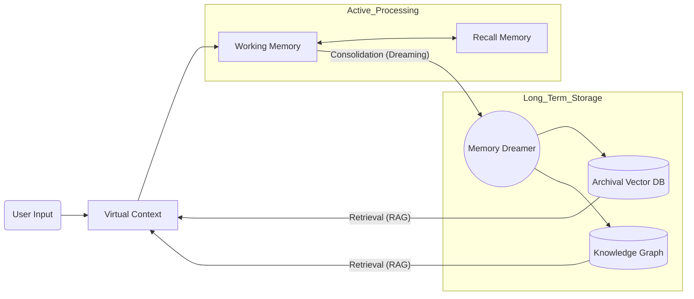
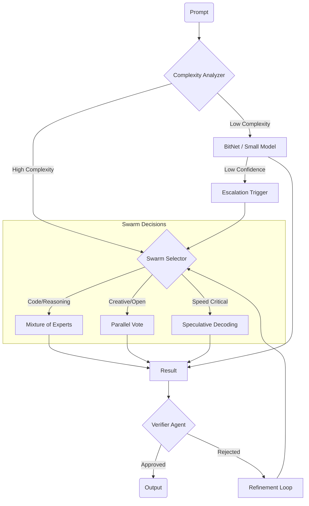
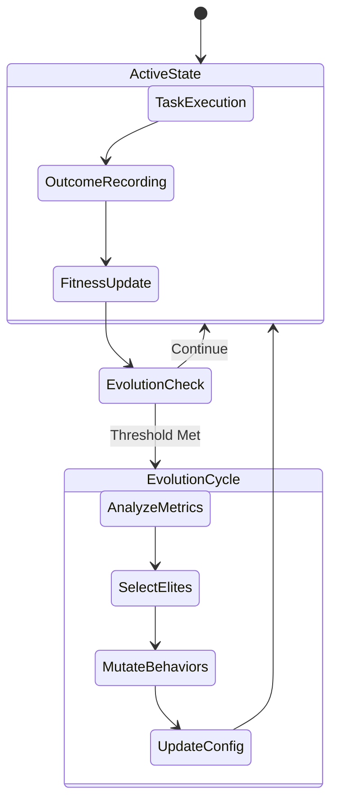
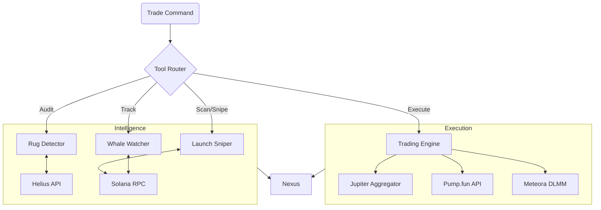

# Farnsworth System Architecture

## 1. High-Level Architecture
The system follows a modular, event-driven architecture centered around the **Nexus** event bus.

```mermaid
graph TD
    User([User / Claude Code]) <--> MCP[MCP Server]
    MCP <--> Nexus{Nexus Event Bus}
    
    subgraph Core [Core Cognition]
        Nexus <--> Planner[Planner Agent]
        Nexus <--> Proactive[Proactive Agent]
        Nexus <--> Swarm[Swarm Orchestrator]
        Nexus <--> Inference[Inference Engine (LLM)]
    end
    
    subgraph Memory [Unified Memory System]
        Nexus <--> MemSys[Memory System]
        MemSys <--> Working[Working Memory]
        MemSys <--> Archival[(Archival DB)]
        MemSys <--> Graph[(Knowledge Graph)]
        MemSys <--> Context[Virtual Context]
    end
    
    subgraph Evolution [Evolutionary Layer]
        Nexus --> Fitness[Fitness Tracker]
        Fitness --> Optimizer[Genetic Optimizer]
        Optimizer --> Behavior[Behavior Mutation]
    end
    
    subgraph Integration [Integrations]
        Swarm <--> Tools[Tool Router]
        Tools <--> Web[Web Agent]
        Tools <--> Vision[Vision Module]
        Tools <--> Solana[Solana DeGen Mob]
    end
```

## 2. Memory Data Flow
How information moves from short-term to long-term storage via Dreaming.



## 3. Advanced Inference Pipeline
The `InferenceEngine` uses a sophisticated cascade and swarm approach.



## 4. Evolutionary Feedback Loop
How Farnsworth improves over time.



## 5. DeGen Mob Integration
The specialized Solana trading subsystem.


