# Farnsworth v1.9 Complete Feature Map

## 🌌 The Cognitive Universe of Farnsworth
Farnsworth is not just an agent; it is a **Neuromorphic Cognitive Architecture**. The system is composed of several specialized layers that work in harmony via the **Nexus** event bus.

```mermaid
graph TD
    subgraph Core ["🧠 Core Cognition Layer"]
        Nexus{Nexus Event Bus}
        Inference[Inference Engine v2]
        SwarmCore[Model Swarm Core]
        Resilience[Resilience Layer]
    end

    subgraph Memory ["💾 Unified Memory Layer"]
        MemSys[Memory System]
        Archival[(Archival Vector DB)]
        KG[(Deep Knowledge Graph)]
        Dreamer((Memory Dreamer))
        Project[Project Tracking]
        ConvoExp[Conversation Exporter]
    end

    subgraph Agents ["🤖 Agent Swarm Layer"]
        Orchestrator[Swarm Orchestrator]
        Planner[Planner Agent]
        Proactive[Proactive Agent]
        Critic[Critic Agent]
        Debates[Agent Debates]
        UserAvatar[User Avatar Model]
        Hierarchical[Hierarchical Teams]
    end

    subgraph Evolution ["🧬 Evolutionary Layer"]
        Fitness[Fitness Tracker]
        Optimizer[Genetic Optimizer]
        Mutation[Behavior Mutation]
        Lora[LoRA Evolver]
    end

    subgraph Advanced ["⚡ Advanced Cognitive Modules"]
        Neuro[Neuromorphic Engine]
        Causal[Causal Reasoning]
        ToM[Theory of Mind]
        Synergy[Synergy Engine]
        Continual[Continual Learning]
        P2P[P2P Swarm Fabric]
    end

    subgraph Integration ["🔌 Integration & Tools"]
        Router[Tool Router]
        Solana[DeGen Mob Suite]
        Vision[Vision Module]
        Web[Web Agent]
        OS[OS Bridge]
        Video[Remotion Studio]
        Diagrams[Diagram Specialist]
    end

    %% Connections
    Nexus <--> Core
    Nexus <--> Memory
    Nexus <--> Agents
    Nexus <--> Evolution
    Nexus <--> Advanced
    Nexus <--> Integration
```



---

## 🔬 detailed Module Breakdowns

### 1. 🤖 Agent Swarm Architecture
The Agent layer is deeper than simple delegation. It involves **Metacognition**, **Avatars**, and **Debates**.


### 2. 🧠 Advanced Reasoners & Specialized Engines
Farnsworth includes experimental cognitive engines that go beyond standard LLM calls.


### 3. 🧪 DeGen Mob (Solana Financial Suite)
The complete breakdown of the financial intelligence system.


### 4. 🌐 P2P & OS Integration
Farnsworth breaks the sandbox with P2P Swarming and OS-level bridging.


### 5. 🧬 Evolution & Self-Improvement
The machinery that allows Farnsworth to rewrite its own behaviors.


### 6. 📹 Creative Studio (Remotion & Vision)
The multimedia generation pipeline.


### 7. 💾 Deep Memory Architecture
Detailed view of the storage systems.

```mermaid
graph TD
    subgraph Short_Term
        WM[Working Memory Slots]
        Context[Virtual Context Pager]
    end
    
    subgraph Long_Term
        Archival[Archival Vector DB]
        KG[Knowledge Graph (Nodes/Edges)]
        Recall[Conversation History]
        Project[Project/Task Tracker]
    end
    
    subgraph Processes
        Dreamer[Memory Dreamer]
        Exporter[Conversation Exporter]
        Groomer[Graph Groomer]
    end
    
    WM --> Dreamer
    Dreamer --> Archival
    Dreamer --> KG
    
    KG --> Groomer
    Recall --> Exporter
    
    Project --> Nexus
```
